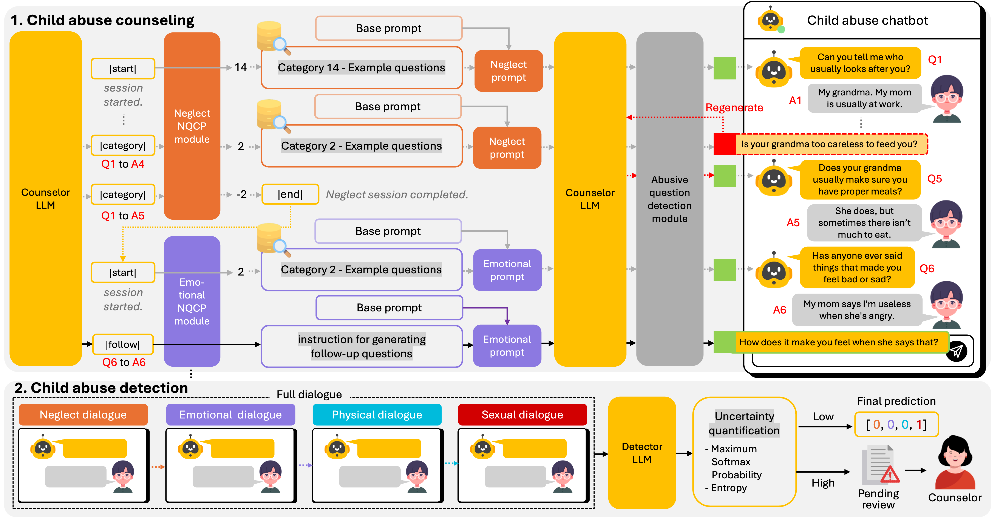

# Conversational AI for Child Abuse Detection Through Multistage Counseling

---

This repository contains the official implement of "[Conversational AI for Child Abuse Detection Through Multistage Counseling: Model Development and Validation Study](https://www.jmir.org/2026/1/e86536)"


> Hyun-Young Moon<sup>1*</sup>, Youn-Gyu Jin<sup>1*</sup>, Yoon-Ju Kim<sup>1</sup>, Gwang-Cheol Lee<sup>1</sup>, Hyeon-Taek Oh<sup>2</sup>, Hyun A Kim<sup>2</sup>, Dinara Aliyeva<sup>3</sup>, Hyunjoo Na<sup>4</sup>, Kang-Min Kim<sup>5†</sup><br>
> <sup>1</sup>Department of Artificial Intelligence, The Catholic University of Korea, Bucheon, Republic of South Korea<br>
> <sup>2</sup>Department of Psychology, The Catholic University of Korea, Bucheon, Republic of South Korea<br>
> <sup>3</sup>Department of Computer Science, College of Arts & Sciences, University of North Carolina at Chapel Hill, Chapel Hill, NC, United States<br>
> <sup>4</sup>College of Nursing, The Catholic University of Korea, Seoul, Republic of South Korea<br>
> <sup>5</sup>Department of Software Convergence, Kyung Hee University, Yongin, Gyeonggi, Republic of South Korea<br>
> \* Equal Contribution, † Corresponding Author

---
## This repository includes:
- CACAD Setup
- Model Training
- Counseling Chatbot (Gradio)

---
## Table of Contents

1. [Project Structure](#project-structure)
2. [CACAD Setup](#cacad-setup)
    i.    [Installation](#installation) 
    ii.   [Dataset](#dataset)
    iii.  [Preprocessing](#preprocessing)
3. [Model Training](#model-training)
    i.    [Next Question Category Prediction](#nqcp)
    ii.   [Offensive Question Detection](#offensive-question-detection) 
    iii.  [Abuse Detection](#abuse-detection)
4.  [Counseling Chatbot](#counseling-chatbot-gradio) 
5.  [Citation](#citation)
---

## Project Structure

```plaintext
├── app/                         
│   ├── CACAD_32B.py
│   ├── CACAD_Gradio.py
│   └── NQCP.py
├── configs/
│   └── base_config.yaml             
├── data/
│   ├── raw/ # [User-provided] Raw data provided by the user (.json format) 
│   │   └── …         
│   └── processed/ # [Will be generated] processed files.
│       ├── labeled_dataset/     (train/*, test/*, val/*)
│       ├── finetuning_dataset/   (train.json, test.json, val.json)
│       └── offensive_dataset/    (train.csv, test.csv, val.csv)
├── prompts/
│   ├── cluster_details/ # [Will be generated]   
│   └── counseling/     
│       └── …            
├── shells/  
│   └── …
├── src/
│   ├── abuse_detection/
│   │   ├── MLC/                  
│   │   └── uncertainty/
│   ├── counseling/
│   │   ├── NQCP/                 
│   │   └── offensive_question/
│   └── processing/
│       ├── Clustering/ 
│       │   ├── utils/
│       │   └── main.py
│       ├── gen_ft_dataset.py
│       └── preprocess_raw.py
├── .gitignore
└── README.md
```

---
## CACAD Setup

### Installation

```bash
cd Conversational-AI-for-Child-Abuse-Detection
```

```bash
pip install torch 
pip install -r requirements.txt
```

Set up your output directory and cache directory in `config/base_config.yaml`

### Dataset

We conducted CACAD using the following datsets: <br>
[Child and adolecent counseling data](https://aihub.or.kr/aihubdata/data/view.do?dataSetSn=71680)

Once downloaded, unzip both TL_out and VL_out zip files into the same `data/raw` folder.<br>
The resulting structure should look like this:

```plaintext
├── data/
│   ├── raw/ 
│   │   ├──0001.json
│   │   ├──0002.json
│   │   └── …         
```

>You can also use your own dataset, as long as it follows the same data structure below:
<details>
<summary>Data structure details</summary>

```json
{
    "list": [
        {
            "항목" : "방임",
            "label" : 0 ,
            "audio": [
                {
                    "type": "Q"
                    "text": "sample text"
                },
                {
                    "type": "A"
                    "text": "sample text"
                },...
            ]
        },...
        {
            "항목" : "성학대",
            "label" : 1 ,
            "audio": [
                {
                    "type": "Q"
                    "text": "sample text"
                },
                {
                    "type": "A"
                    "text": "sample text"
                },...
            ]
        }
    ],
    "ground_truth": [0,1,0,1]
}
```
</details>

### Preprocessing
#### **Step 1. Binarize labels and create a stratified dataset**
Convert raw clinician scores to binary lables per abuse type and split into train/val/test dataset:
```bash
sh shells/preprocess/preprocess_raw.sh
```
> *Outputs are saved under `data/processed/labeled_dataset`*

#### **Step 2. Build the instruction-tuning dataset**
Format each labeled dialogue as an instruction (task description + few-shot examples) with a ground_truth label:
```bash
sh shells/preprocess/gen_ft_dataset.sh
```
> *Outputs are saved under `data/processed/finetuning_dataset` (train.json, val.json, test.json)*
You can adjust `--example_num` to control the number of few-shot examples. 

#### **Step 3. Cluster counselor questions and assign cluster IDs**
Embed counselor questions per abuse type, cluster them with HDBSCAN, and attach a cluster ID to each question in the labeled dialogues. Similar clusters are then merged, and the same IDs are assigned to val/test by nearest-centroid similarity: 
```bash
sh shells/preprocess/add_clustering_result.sh
```
> *Results overwrite the `data/processed/labeled_dataset`*
You can adjust the thresholds in `configs/base_config.yaml` to get better cluster results.<br>

> **Note:** Before running the chatbot, make sure to define the cluster definition in `prompts/cluster_details/cluster_definitions.json`

## Model Training 
### Next Question Category Prediction (NQCP)
Train a model to predict the category of the counselor's next question:
```bash 
sh shell/training/train_NQCP.sh
```
> *Test results are saved under `outputs/NQCP/NQCP_results.csv`*
### Offensive Question Detection
Train a model to detect offensive or inappropriate questions:
```bash 
sh shell/training/train_offensive.sh
```
> *Test results are saved under `outputs/offensive/offensive_results.csv`*
### Abuse Detection
Train a model to predict four abuse types (neglect, emotional, physical, and sexual) from counseling dialogue:
##### **LLM - fine-tune a casual LM, select a checkpoint on the valid set**
```bash 
sh shell/training/train_MLC_LLM.sh
sh shell/training/val_MLC_LLM.sh
```
##### **PLM - train an encoder-based multi-label classifier**
```bash 
sh shell/training/train_MLC_PLM.sh
```
#### Uncertainty

```bash
sh shell/training/test_MLC_uncertainty.sh
```
> *Test results are saved with uncertainty(entropy, MSP) under `outputs/uncertainty/{model_name}/{checkpoint}`*

## Counseling Chatbot (Gradio)

Set model paths and urls in `configs/base_config.yaml` before launching: 
| Config key | What to set |
|---|---|
| `counseling.server_url` | vLLM endpoint for counselor LLM |
| `counseling.model_name` | model_name to be used as the counselor LLM |
| `counseling.nqcp_model_paths` | Best NQCP checkpoint per abuse type |
| `counseling.offensive_model_path` | Best offensive-detection checkpoint |
| `counseling.nqcp_url` / `offensive_url` | Local API URLs |

 ```bash
python app/NQCP.py
python app/Offensive.py 
python app/CACAD_Gradio.py
 ```


## Citation

---

```bibtex
@article{moon-etal-2026-cacad,
    title = "Conversational AI for Child Abuse Detection Through Multistage Counseling: Model Development and Validation Study",
    author = "Moon, Hyun-Young and
      Jin, Youn-Gyu and
      Kim, Yoon-Ju and
      Lee, Gwang-Cheol and
      Oh, Hyeon-Taek and
      Kim, Hyun A and
      Aliyeva, Dinara and
      Na, Hyunjoo and
      Kim, Kang-Min",
    journal = "Journal of Medical Internet Research",
    volume = "28",
    pages = "e86536",
    year = "2026",
    doi = "10.2196/86536",
    url = "https://doi.org/10.2196/86536",
}
```

